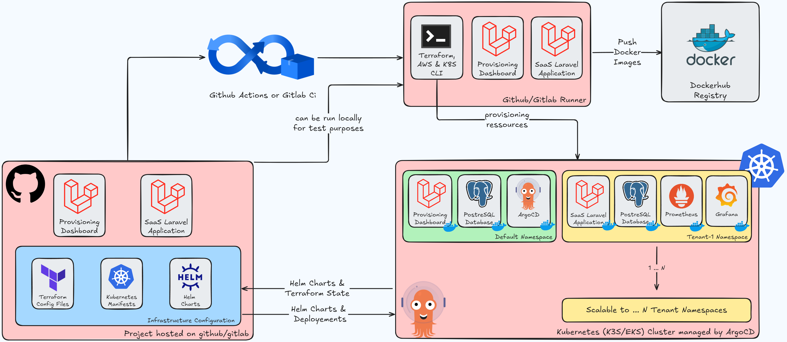

# Multi-Tenant SaaS Platform with Terraform, ArgoCD, and Kubernetes

## Overview

This project provisions a scalable, multi-tenant SaaS laravel platform where each tenant gets an isolated environment with their own services. The platform uses **Terraform** for infrastructure provisioning and **ArgoCD** for continuous application delivery, following a **GitOps** workflow.

## Project Overview

This project provides a robust multi-tenant SaaS platform built with **Laravel**, deployed on **Amazon EKS** (Elastic Kubernetes Service), with automated tenant provisioning, management, and monitoring.

## Architecture

### Key Components

- **Frontend Management**: Laravel Dashboard
- **Infrastructure Provisioning**: Terraform
- **Kubernetes Deployment**: Helm & ArgoCD
- **Monitoring**: Grafana & Prometheus
- **Cloud Platform**: Amazon EKS
- **Database**: PostgreSQL

### Tenant Lifecycle Management

The platform offers a complete tenant management solution with:

- Automated namespace creation
- Dedicated PostgreSQL database
- Individual Laravel application deployment
- Comprehensive monitoring setup

## Prerequisites

### Infrastructure

- Kubernetes Cluster (EKS)
- Terraform
- Helm
- ArgoCD
- PostgreSQL
- Grafana
- Prometheus

### Development Environment

- PHP 8.2+
- Laravel 10.x
- Composer
- Docker
- kubectl
- AWS CLI

## Features

- Multi-tenancy: Each tenant has an isolated environment (namespace) on Kubernetes.
- **Automated Provisioning**: Use **Terraform** to create the infrastructure on AWS and Kubernetes.
- **GitOps Deployment**: Use **ArgoCD** to manage continuous delivery and application deployment.
- **Tenant Management**: Use a **Laravel dashboard** to manage tenant creation and application provisioning.

## Architecture



## Project Structure:

```bash
multi-tenant-saas-platform/
├── terraform/
│   ├── dev/
│   │   ├── main.tf                    # Provision a VM for K3s
│   │   ├── variables.tf               # Variables for VM setup
│   │   ├── outputs.tf                 # Outputs for connecting to the VM
│   │   └── k3s-install-script.sh      # Installs K3s on the VM
│   ├── prod/
│   │   ├── main.tf                    # Provision EKS cluster
│   │   ├── variables.tf               # Variables for EKS setup
│   │   ├── outputs.tf                 # Outputs for connecting to EKS
│   │   └── eks-config.tf              # Configures EKS resources (VPC, IAM, etc.)
│   └── provider.tf                    # Cloud provider setup (for both dev and prod)
│
├── argo-cd/
│   ├── bootstrap.yaml                 # Deploys ArgoCD in both K3s and EKS
│   ├── applications/
│   │   ├── laravel-dashboard.yaml     # Deployment for Laravel Dashboard
│   │   ├── tenant-app-template.yaml   # Deployment template for tenant apps
│   │   └── prometheus-grafana.yaml    # Deployment for monitoring tools
│   └── values.yaml                    # ArgoCD Helm chart values
│
├── laravel-dashboard/
│   ├── Dockerfile                     # Container for Laravel Dashboard
│   ├── docker-compose.override.yml    # For local development (optional)
│   ├── .env                           # Configuration for Laravel
│   ├── app/                           # Laravel app logic
│   ├── routes/                        # Routes for tenant management
│   └── database/                      # PostgreSQL database for managing tenants
│
├── tenant-helm-charts/                # Helm charts for tenant apps
│   ├── tenant-app-chart/
│   └── monitoring-chart/              # Prometheus and Grafana
│
└── README.md                          # Documentation

```

## Architecture Diagram:

```sql
                                      +-----------------------+
                                      |   Laravel Dashboard   |
                                      |   (Tenant Management) |
                                      +-----------------------+
                                                 |
                                                 | (Triggers provisioning)
                                                 v
                                       +---------------------+
                                       |  Terraform          |
                                       |  (Provision K8s     |
                                       |  namespaces,        |
                                       |  resources)         |
                                       +---------------------+
                                                 |
                                                 v
                                       +---------------------+
                                       |    Kubernetes       |
                                       |    (Provisioning    |
                                       |    and managing     |
                                       |    Tenant Resources)|
                                       +---------------------+
                                                 |
                                                 v
                 +--------------------+         +-------------------+       +---------------------+
                 | SaaS Laravel App 1  |         |  PostgreSQL DB 1  |       |   Prometheus 1       |
                 | (Tenant-specific)   |         | (Tenant-specific) |       | (Tenant-specific)    |
                 +--------------------+         +-------------------+       +---------------------+
                              |                              |                          |
                              v                              v                          v
                 +--------------------+         +-------------------+       +---------------------+
                 | SaaS Laravel App 2  |         |  PostgreSQL DB 2  |       |   Grafana 2          |
                 | (Tenant-specific)   |         | (Tenant-specific) |       | (Tenant-specific)    |
                 +--------------------+         +-------------------+       +---------------------+
                              |                              |                          |
                              v                              v                          v
                            ...                            ...                        ...
```

## Installation

### 1. Clone the Repository

```bash
git clone https://github.com/anas1412/multi-tenant-saas-platform.git
cd multi-tenant-saas-platform
```

### 2. Run Docler Compose

```bash
docker-compose up -d --build

```

### 3. Run Tests

```bash
docker-compose exec laravel-dashboard php artisan test
```

### 4. Push to DockerHub

Log in to DockerHub and push your Docker images with the `latest` tag:

```bash
docker login --username=anas1412
docker tag laravel-dashboard anas1412/laravel-dashboard:latest
docker push anas1412/laravel-dashboard:latest
```

### 4. Infrastructure Setup

```bash
# Initialize Terraform
terraform init

# Plan infrastructure
terraform plan

# Apply infrastructure
terraform apply
```

### 5. Kubernetes Configuration

```bash
# Configure kubectl
aws eks --region <your-region> update-kubeconfig --name <cluster-name>

# Install Helm charts
helm install tenant-platform ./helm-charts
```

## Tenant Provisioning Workflow

1. **Dashboard Interaction**: Use Laravel dashboard to initiate tenant creation
2. **Terraform Provisioning**:
   - Create Kubernetes namespace
   - Provision PostgreSQL database
3. **Helm Deployment**: Deploy Laravel application
4. **ArgoCD Synchronization**: Manage and sync Kubernetes deployments
5. **Monitoring Setup**: Configure Grafana and Prometheus for the new tenant

## Monitoring

The platform includes integrated monitoring with:

- Grafana dashboards
- Prometheus metrics collection
- Per-tenant performance tracking

## Security Considerations

- Isolated Kubernetes namespaces
- Separate PostgreSQL databases
- Role-based access control (RBAC)
- Secrets management

## Scaling & Performance

- Horizontal Pod Autoscaler (HPA) configured
- Resource quotas per tenant
- Efficient multi-tenant architecture
